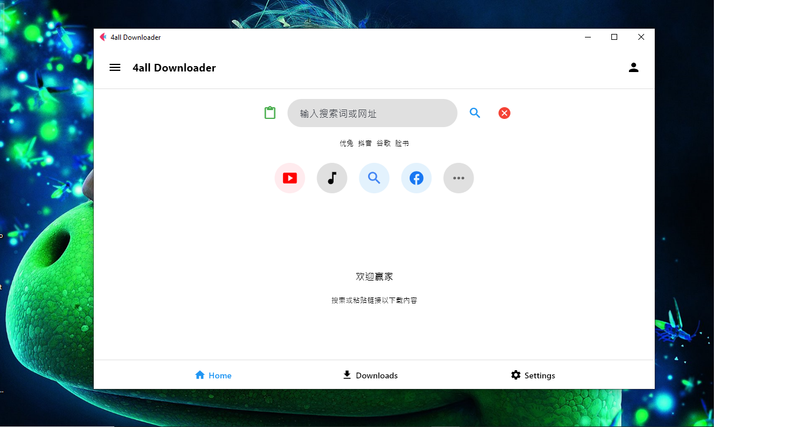

# Yt-dlite

**Yt-dlite** is a lightweight, versatile video/audio downloader that offers both a clean GUI and powerful command-line interface. Built on top of yt-dlp with simplicity in mind, and they works similarly in many ways.


official link

https://1winner137.github.io/ytdlite/index.html

## Yt-dlite version 2 - to be released mid of june
will go by name 4all downloader as it is kind ultimate, going to be the best downloadr so far by combining all power of all opensource mdeia downloader and custom downloader executable. biult in media player, custom design, mult-lingual. all features of yt-dlite version1.0.0. check this link

https://github.com/1winner137/4all-downloader

sample image

  

This is just a sample image, showcasing multilingual support for popular languages such as Spanish, Arabic, Hindi, English, French, Swahili, Korean, German, and many others.


## Features

- **Dual Interface**: Use the intuitive GUI or efficient command-line interface.
- **Multiple User Modes**: Choose from Novice, Professional, or Expert modes tailored to your experience level.
- **Dark and Light**: Switch between dark and light themes for a better user experience.
- **Versatile Search**: Search using keywords or direct URLs for fast and flexible access to content.
- **Multi-Download Support**: Download multiple files simultaneously with intelligent queue management.
- **High-Resolution Support**: Handle 4K, 1080p, 720p, 480p, 360p, 240p, and other resolutions with quality preservation.
- **Format Options**: Download videos in mp4, mkv, webm, avi, and more.
- **Audio Extraction**: Extract audio in mp3, m4a, wav, and other formats.
- **Video and Audio Conversion**: Convert media to a wide variety of formats using FFmpeg (mp4, mkv, avi, gif, etc.).
- **PlayList Download**: Download entire playlists or select specific items with ease.
- **Format Listing**: View and select from all available quality and format options before downloading.
- **Safe Filenames**: Automatic sanitization to prevent issues with special characters.
- **Resume Support**: Continue interrupted downloads even after closing the app or system restart.
- **Download Control**: Pause, resume, cancel, and restart downloads anytime with session memory.
- **Subtitle Integration**: Download and embed subtitles in various languages.
- **Verbosity**: Supports ERROR, DEBUG, and INFO logging levels for better troubleshooting - GUI.
- **Real-Time Monitoring**: Track download progress live with detailed logs and progress bars.
- **Custom Output**: Browse and choose where to save your files.
- **User-Centric Design**: Effortlessly manage downloads and settings through a clean and intuitive interface.
- **Active User Support**: Fast assistance and continuous improvement based on user feedback.


## Installation

### Requirements

- Python 3.6+
- FFmpeg (required for format conversion and merging), but not MUST

## Install FFmpeg (platform specific)
- **Windows:** [Download FFmpeg](https://ffmpeg.org/download.html), extract, and add it to `PATH`.  
  - Recommended build: [FFmpeg Git Full](https://www.gyan.dev/ffmpeg/builds/ffmpeg-git-full.7z)  

- **macOS:**  brew install ffmpeg
- **Ubuntu\Debian:** sudo apt install ffmpeg
- **Fedora:** sudo dnf install ffmpeg

### Quick Install
#### Windows
```bash
# Clone the repository
git clone https://github.com/1winner137/yt-dlite.git
cd yt-dlite/installation
# Run installation
installation.bat
```
#### Debian(Linux\Ubuntu\Pop!_os\Zorin\Parrot\Mint\etc..)
```bash
# Clone the repository
git clone https://github.com/1winner137/yt-dlite.git
cd yt-dlite/installation
# Run installation
chmod +x ./installation_debian.sh && ./installation_debian.sh
```

## Usage

### GUI Mode

Launch the graphical interface with:

```bash
python yt-dlitec.py --gui
```

The GUI provides a simple interface for:
- Entering video/audio URLs or searching with keywords
- Selecting output format and quality before downloading (4K, 1080p, 720p, etc.)
- Choosing the download location with folder browsing
- Monitoring download progress with real-time status updates
- Resuming interrupted or incomplete downloads with session memory
- Freedom to choose from a wide range of formats (mp4, mkv, mp3, etc.)
- Downloading entire playlists or selecting specific items from them
- Converting videos and audio to different formats using FFmpeg (mp4, avi, mp3, m4a, gif, etc.)
- Switching between Dark and Light mode for better comfort
- Managing multiple downloads with queue control
- Accessing different user modes (Novice, Professional, Expert)
- Embedding subtitles and converting media with professional-grade encoding
- Viewing and controlling logs for troubleshooting (ERROR, DEBUG, INFO)


### Command-Line Interface

yt-dlite offers a powerful CLI for quick downloads and automation:

```bash
# Download video (default: mp4)
python yt-dlite.py --video https://www.youtube.com/watch?v=example

# Download audio (default: mp3)
python yt-dlite.py --audio https://www.youtube.com/watch?v=example

# Specify format
python yt-dlite.py --video https://www.youtube.com/watch?v=example --format webm

# Resume interrupted download
python yt-dlite.py --resume --video https://www.youtube.com/watch?v=example

# List all available formats
python yt-dlite.py --list-formats https://www.youtube.com/watch?v=example

# Specify output directory
python yt-dlite.py --video https://www.youtube.com/watch?v=example --output /path/to/save
```

## Advanced Usage

### Format Selection

List available formats:

```bash
python yt-dlite.py --list-formats https://www.youtube.com/watch?v=example
```

This will display all available formats with their IDs, extensions, and resolutions, not limited to youtube site.

### Resume Downloads

yt-dlite can continue partially downloaded files:

```bash
python yt-dlite.py --resume --video https://www.youtube.com/watch?v=example
```

### miscellaneous

Download playlist:

```bash
python yt-dlite.py --video https://www.youtube.com/watch?v=example --output ~/Downloads
```
It works like yt-dlp, so you can use --no-playlist to download a single video instead of a whole playlist
## Contributing

Contributions are welcome! Please feel free to submit a Pull Request.

1. Fork the repository
2. Create your feature branch (`git checkout -b feature/amazing-feature`)
3. Commit your changes (`git commit -m 'Add some amazing feature'`)
4. Push to the branch (`git push origin feature/amazing-feature`)
5. Open a Pull Request

## License

This project is licensed under the GNU GPLv3.0 License - see the LICENSE file for details.

## Donation
Conside donating
BTC : bc1qyr88kayp9nqve9u9jpav4kft4ln3rgu7wwqn4h 

Paypal : winnernova7@gmail.com

## Acknowledgments

- Built on the excellent [yt-dlp](https://github.com/yt-dlp/yt-dlp) library
- Thanks to all contributors and users for suggestions and feedback

## Disclaimer

This tool is for personal use only. Please respect copyright laws and the YouTube Terms of Service. yt-dlite developers and contributors are not responsible for misuse of this software.
